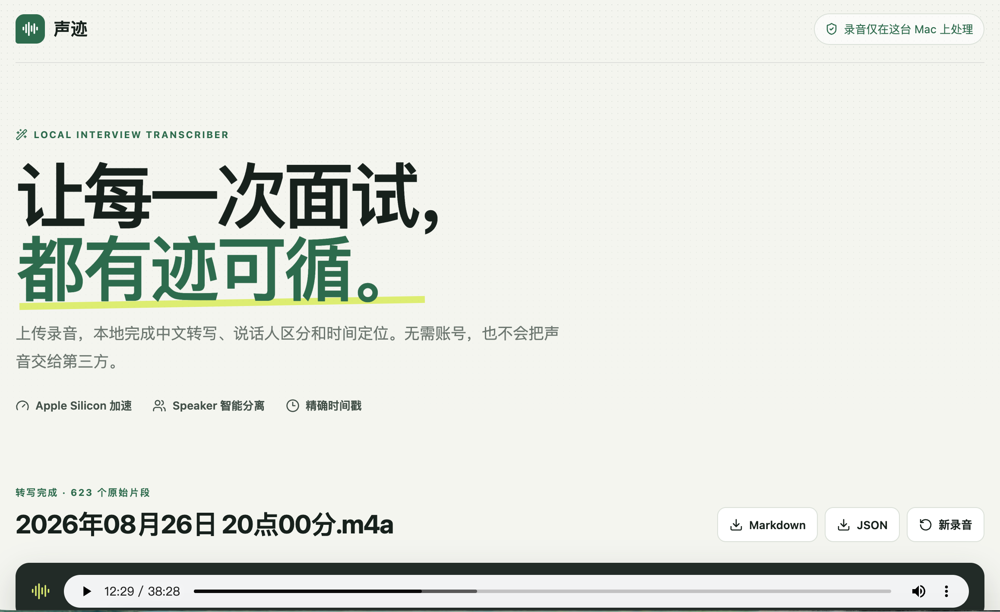

# 声迹 · Interview Transcriber

> 在 Mac 本地把面试录音整理成带说话人、时间戳的可读文字。



声迹是一款面向中文技术面试的本地录音转写工具。它基于 FunASR 完成语音识别、VAD 切片、标点恢复与说话人聚类，并提供 React 网页界面和 Python CLI。录音与转写结果默认只保存在你的电脑上，无需账号，也不会上传到第三方服务。

## 功能

- 中文为主、中英技术词混合的录音转写
- CAM++ 匿名说话人分离，可在页面中重命名和筛选 Speaker
- 转写前按开始/结束时间裁剪录音，只处理需要保留的连续区间
- 6 秒 VAD 精细切片，降低一段语音混入多位说话人的概率
- 实时展示处理阶段、片段进度、已用时间与预计剩余时间
- 点击时间戳直接跳转并回听原始录音
- 同一说话人相邻片段自动合并，保留原始切片视图
- 导出 Markdown 与 JSON
- 本地历史记录，服务重启后仍可查看或删除
- 历史记录可重命名，并同步更新本地音频、Markdown 和 JSON 文件名
- Apple Silicon MPS、NVIDIA CUDA 与 CPU 推理

## 处理流程

```text
录音文件
  └─ FSMN-VAD：检测语音并切片
      └─ Paraformer：语音识别
          ├─ CT-Punc：标点恢复
          └─ CAM++：说话人聚类
              └─ 标准化与合并
                  ├─ 本地网页查看 / 回听
                  ├─ Markdown
                  └─ JSON
```

## 技术栈

- 后端：Python、FastAPI、FunASR、PyTorch
- 模型：Paraformer-zh、FSMN-VAD、CT-Punc、CAM++
- 前端：React、TypeScript、Vite
- 音频解码：FFmpeg

## 环境要求

- macOS（已在 Apple Silicon 上验证）
- Python 3.10+
- Node.js 20+
- Homebrew 与 FFmpeg
- 首次运行需要联网下载 FunASR 模型，之后使用本机缓存

## 快速开始

### 1. 安装后端依赖

```bash
brew install ffmpeg

python3 -m venv .venv
source .venv/bin/activate
python -m pip install --upgrade pip
python -m pip install torch torchaudio
python -m pip install -r requirements.txt
```

Apple Silicon 默认自动使用 PyTorch MPS。可以用下面的命令确认：

```bash
python -c "import torch; print(torch.backends.mps.is_available())"
```

输出 `True` 表示 MPS 可用；不可用时仍可使用 CPU。

### 2. 构建前端

```bash
cd frontend
npm install
npm run build
cd ..
```

### 3. 启动本地网页

```bash
source .venv/bin/activate
python web.py
```

打开 [http://127.0.0.1:8000](http://127.0.0.1:8000)。服务仅监听本机地址，局域网和公网无法直接访问。

## 网页使用

1. 拖入或选择 `m4a`、`mp3`、`wav`、`flac`、`aac`、`ogg` 录音。
2. 如需去掉开头或结尾的无关内容，在“裁剪录音”中设置保留区间并试听。
3. 点击“开始转写”，等待本地模型完成音频准备和识别。
4. 点击时间戳回听，或点击说话人色点筛选对应内容。
5. 根据需要重命名 Speaker，切换“合并阅读”和“原始切片”。
6. 下载 Markdown / JSON，或稍后从首页历史记录重新打开。

裁剪在后端通过 FFmpeg 生成新的工作音频，不会修改你选择的原始文件；转写时间戳从裁剪后音频的 `00:00` 开始。历史记录会保留对应工作音频和输出文件，只有在页面中确认删除后，任务相关文件才会被移除。

## 命令行使用

```bash
source .venv/bin/activate
python transcribe.py ~/Downloads/interview.m4a
```

默认输出：

```text
output/interview.md
output/interview.json
```

指定设备、输出目录和 CPU 线程数：

```bash
python transcribe.py input/interview.m4a \
  --output-dir output \
  --device mps \
  --ncpu 4
```

设备参数支持 `auto`、`mps`、`cpu` 和 `cuda:0`。如 MPS 遇到模型兼容问题，可使用 `--device cpu` 重试。

### 说话人切片策略

默认使用适合长录音的 `vad_segment`，并把 VAD 最大单段限制为 6 秒：

```bash
python transcribe.py input/interview.m4a \
  --speaker-mode vad_segment \
  --max-segment-seconds 6
```

切片越短，一段内容混入两位说话人的概率通常越低，但原始片段也会更碎。JSON 始终保留原始片段和时间戳；Markdown 默认将间隔不超过 2 秒的相邻同 Speaker 片段用中文逗号连接。网页“合并阅读”可以在 1–10 秒范围内按整秒调整合并间隔，这项设置只影响页面显示，不修改原始 JSON。

也可以对比基于标点切句的模式：

```bash
python transcribe.py input/interview.m4a --speaker-mode punc_segment
```

## 自定义技术词

编辑 `config/hotwords.txt`，每行填写一个词，也可以在词后添加整数权重：

```text
React
Hydration 30
Micro Frontend
```

权重越高，模型越倾向于输出该词。建议只为真实高频且容易识别错误的术语逐步提高权重。

## 开发与测试

开发模式需要分别启动后端和 Vite：

```bash
# 终端 1：项目根目录
source .venv/bin/activate
python web.py

# 终端 2
cd frontend
npm run dev
```

开发页面地址为 [http://127.0.0.1:5173](http://127.0.0.1:5173)。

运行验证：

```bash
source .venv/bin/activate
python -m unittest discover -s tests -v

cd frontend
npm run build
```

## 项目结构

```text
backend/              FastAPI 接口、任务进度与历史记录
config/hotwords.txt   自定义热词
frontend/             React + TypeScript 页面
src/asr.py            FunASR 推理和结果标准化
src/formatter.py      Markdown / JSON 格式化
tests/                后处理与合并逻辑测试
transcribe.py         命令行入口
web.py                本地网页入口
input/                本地录音（Git 忽略）
output/               本地转写结果（Git 忽略）
```

## 隐私与识别边界

- `input/`、`output/`、虚拟环境、模型缓存和前端构建产物不会提交到 Git。
- `Speaker 0` / `Speaker 1` 是单次录音内的匿名声纹簇，不自动等同于面试官或候选人，也不保证跨录音编号一致。
- 重叠说话、强噪声、远距离收音、音量差异和很短的应答都可能影响说话人聚类。
- 项目当前不使用 LLM 修订转写内容，导出前请检查涉及姓名、公司与联系方式的文本。
